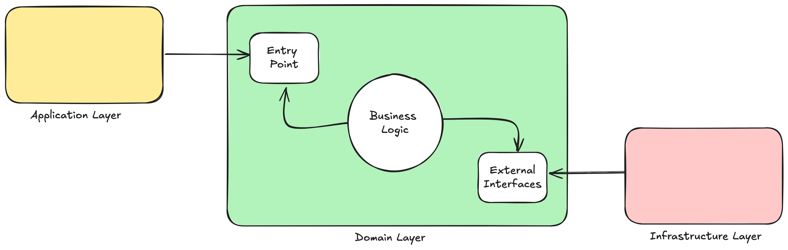
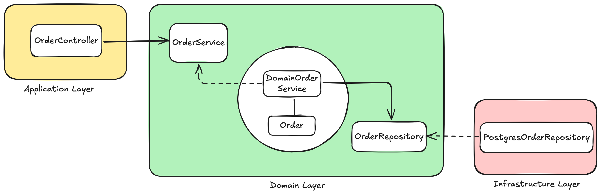

[](https://sonarcloud.io/summary/new_code?id=com.fiap.challenge%3Afast-food)
[](https://sonarcloud.io/summary/new_code?id=com.fiap.challenge%3Afast-food)

# 🍔 Fast Food

O Fast Food é um sistema que permite que o cliente faça pedidos de forma autônoma, sem a necessidade de um atendente. O cliente pode visualizar o cardápio, adicionar itens ao carrinho, visualizar o carrinho, finalizar o pedido e realizar o pagamento. Após o pagamento, o cliente recebe um código de retirada que pode ser utilizado para acompanhar o status do pedido e para retirada o pedido no balcão.

> Repositório principal de diagramas e visão geral dos micro-serviços do ecossistema *fast-food*.

## 🚀 Visão Geral
Este repositório contém **diagramas**, **documentação de alto nível** e **links** para os micro-serviços responsáveis por cada domínio de negócio:
- **Clientes** - https://github.com/9SOAT/fast-food-consumer
- **Pedidos** - https://github.com/9SOAT/fast-food-order
- **Catalogo** - https://github.com/9SOAT/fast-food-catalog

## 🍟 Tecnologias e Técnicas utilizadas

Neste projeto são utilizadas as seguintes tecnologias:

- **Spring Boot**: Framework Java para criação de aplicações web


- **Java 21**: Linguagem de programação


- **Docker**: Plataforma para desenvolvimento, envio e execução de aplicações em containers


- **Docker Compose**: Ferramenta para definir e executar aplicativos Docker multi-container


- **Postgres**: Banco de dados relacional


- **Liquibase**: Ferramenta para controle de versão de banco de dados


- **Swagger**: Framework para documentação de APIs REST


- **JUnit**: Framework para criação de testes unitários


- **Mockito**: Framework para criação de mocks em testes


- **Hexagonal Architecture**: Arquitetura de software que visa separar a lógica de negócio da lógica de infraestrutura

## 🛠️ Execução Local

### Docker Compose

Pré-requisitos:
- Ter o Docker e Docker Compose instalados

```shell
  docker compose -p fast-food up -d
```

### Kubernetes

Pré-requisitos:
- Ter o Kubernetes instalado e configurado localmente.
- Ter o kubectl instalado e configurado.

#### kubectl

```shell
  kubectl apply -f k8s/
```

Para acessar a aplicação, execute o comando:

```shell
  kubectl port-forward svc/fast-food-svc 8080:8080
```

## 📖 Documentação

Como parte da documentação, foram elaborados alguns artefatos para auxiliar no entendimento da equipe, incluindo:
- Diagramas do C4 Model nas camadas Context, Container e Component, para oferecer uma visão abrangente e estruturada da arquitetura do sistema.
    - [Context](/docs/c4-model/systemcontext.png)
    - [Container](/docs/c4-model/container.png)
    - [Component](/docs/c4-model/component.png)
- Um diagrama de Kubernetes (K8s), acompanhado de uma análise do problema enfrentado: o restaurante está lidando com questões de performance em seu totem.
    - [Diagrama](/docs/k8s/sk8.png)
- Requests (API)
    - Swagger: http://localhost:8080/swagger-ui/index.html
- Video explicativo da aplicação
    - FIAP 9SOAT - Tech Challenge - Fase 4 -
    - FIAP 9SOAT - Tech Challenge - Fase 3 - https://www.youtube.com/watch?v=qosJDcfGu6I
    - FIAP 9SOAT - Tech Challenge - Fase 2 - https://www.youtube.com/watch?v=EIm4ZCKEP04
- Fluxo completo de todas as integrações, sistemas e troca de informações no ecossistema *fast-food*.
    - [Diagrama](/docs/Diagrama_Servicos_Modulo04_FIAP.png)


#### Guia para execução das APIs
**1. Cadastro do Catálogo de Produtos:**
Endpoint: POST '[...]/products'
Descrição: Utiliza este endpoint para cadastrar todos os itens que serão vendidos no seu estabelecimento.

**2. Cadastro de Clientes:**
Endpoint: POST '[...]/consumers'
Descrição: Utilize este endpoint para cadastrar os clientes que farão pedidos.

**3. Criação de um Carrinho:**
Endpoint: POST '[...]/carts'
Descrição: Crie um novo carrinho para cada cliente que iniciar um pedido.
Observação: Este endpoint retorna um ID único para o carrinho criado, que será utilizado nas próximas etapas.

**4. Adição de Itens ao Carrinho:**
Endpoint: POST '[...]/carts/<cartId>/items'
Descrição: Adicione os produtos escolhidos pelo cliente ao carrinho.
Observação: Utilize o ID do carrinho retornado na etapa anterior e especifique a quantidade de cada item.

**5. Checkout do Carrinho:**
Endpoint: POST '[...]/checkout'
Descrição: Finalize o pedido e gere um número de pedido único.

**6. Verificação do Status do Pagamento:**
Endpoint: GET '[...]/orders/:id/payment/status'
Descrição: Verifique o status atual do pagamento do pedido.
Observação: Utilize o ID do pedido para consultar o status. Os possíveis status são: PENDING, APPROVED, REJECTED.

**7. Simulação de Pagamento (Webhook):**
Endpoint: POST '[...]/webhook'
Descrição: Simule uma notificação de pagamento aprovado.
Observação: Envie uma requisição POST para este endpoint com o status "APPROVED" para marcar o pagamento como concluído.

**8. Acompanhamento do Pedido:**
Endpoint: GET '[...]/orders/list?page=&size='
Descrição: Visualize a lista de pedidos, ordenados por status: Pronto, Em Preparação e Recebido.
Observação: Utilize os parâmetros "page" e "size" para paginar os resultados.

**9. Atualização do Status do Pedido:**
Endpoint: PATCH '[...]/orders/:id/status'
Descrição: Atualize o status do pedido conforme ele avança no processo de produção.
Observação: Os possíveis status são: WAITING_PAYMENT, READY_FOR_PREPARATION, IN_PREPARATION, READY_FOR_PICKUP, FINISHED.

## 🍨 Arquitetura Hexagonal

A arquitetura hexagonal, também conhecida como Arquitetura de Portas e Adaptadores, é um estilo de arquitetura de software que visa separar a lógica de negócio da lógica de infraestrutura. Ela promove a criação de sistemas que são mais fáceis de manter, testar e evoluir ao longo do tempo.

#### Principais Conceitos

1. Domínio: Contém a lógica de negócio central da aplicação. É independente de qualquer tecnologia ou framework específico.
2. Portos: Interfaces que definem como a aplicação se comunica com o mundo externo (entrada) e como o mundo externo se comunica com a aplicação (saída).
3. Adaptadores: Implementações concretas das portas. Eles adaptam a comunicação entre o domínio e as tecnologias externas, como bancos de dados, APIs, interfaces de usuário, etc.

#### Estrutura

A arquitetura hexagonal é geralmente representada como um hexágono, onde:

* O núcleo (centro) do hexágono é o domínio.
* As bordas do hexágono são as portas.
* Fora do hexágono estão os adaptadores.

#### Benefícios

* Isolamento da Lógica de Negócio: A lógica de negócio é isolada de detalhes de implementação, facilitando mudanças e testes.
* Facilidade de Testes: Como a lógica de negócio é independente de infraestrutura, testes unitários podem ser realizados sem a necessidade de dependências externas.
* Flexibilidade: Facilita a troca de tecnologias e frameworks sem impactar a lógica de negócio.


#### 📂 Estrutura de pacotes do projeto

```
.
├── application
│   ├── controller
│   ├── request
│   └── response
├── domain
│   ├── model
│   └── ports
│       ├── inbound
│       └── outbound
└── infrastructure
    ├── config
    ├── entity
    ├── integration
    ├── mapper
    └── repository

```


Hexagonal:</img>


Exemplo de Implementação:</img>

Essa estrutura de pacotes e a separação clara de responsabilidades ajudam a manter o código organizado e modular, facilitando a manutenção e evolução do sistema.
